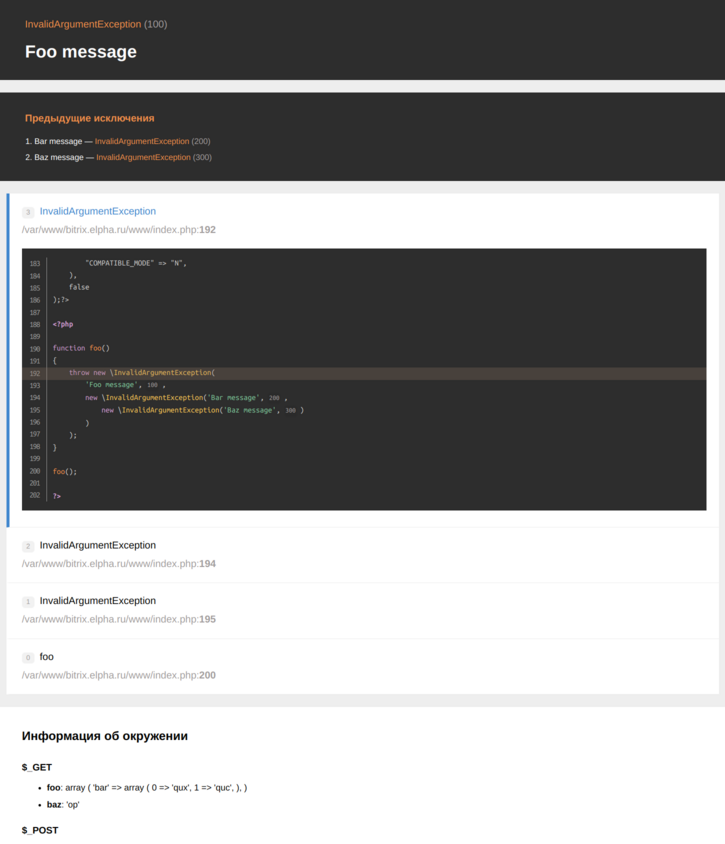
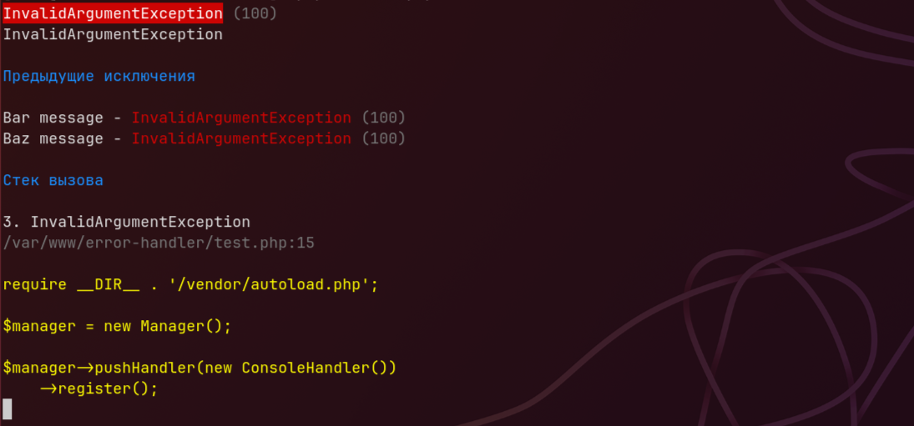

# Стилизует ошибки и упрощает отладку PHP-кода

[![Latest Version][badge-release]][packagist]
[![Software License][badge-license]][license]
[![PHP Version][badge-php]][php]
![Coverage Status][badge-coverage]
[![Total Downloads][badge-downloads]][downloads]
[![Support mail][badge-mail]][mail]

Пакет предоставляет обработчики отображения ошибок в том числе с симпатичным интрефейсом. Он помогает отлаживать код при
реализации вашего веб-проекта.

Обработчик ошибок с симпатичным интрефейсом:



Обработчик вывода в консоль ошибок:



## Установка

Установить этот пакет можно как зависимость, используя Composer.

``` bash
composer require fi1a/error-handler
```

## Использование

Добавьте обработчик реализующий отображение с симпатичным интерфейсом и зарегистрируйте обработку.

```php
use Fi1a\ErrorHandler\Handlers\PrettyPageHandler;
use Fi1a\ErrorHandler\Manager;

$manager = new Manager();

$manager->pushHandler(new PrettyPageHandler())
    ->register();
```

Доступные обработчики:

- `Fi1a\ErrorHandler\Handlers\PrettyPageHandler` - обработчик симпатичным интерфейсом;
- `Fi1a\ErrorHandler\Handlers\ConsoleHandler` - обработчик вывода в консоль.

[badge-release]: https://img.shields.io/packagist/v/fi1a/error-handler?label=release
[badge-license]: https://img.shields.io/github/license/fi1a/error-handler?style=flat-square
[badge-php]: https://img.shields.io/packagist/php-v/fi1a/error-handler?style=flat-square
[badge-coverage]: https://img.shields.io/badge/coverage-100%25-green
[badge-downloads]: https://img.shields.io/packagist/dt/fi1a/error-handler.svg?style=flat-square&colorB=mediumvioletred
[badge-mail]: https://img.shields.io/badge/mail-support%40fi1a.ru-brightgreen

[packagist]: https://packagist.org/packages/fi1a/error-handler
[license]: https://github.com/fi1a/error-handler/blob/master/LICENSE
[php]: https://php.net
[downloads]: https://packagist.org/packages/fi1a/error-handler
[mail]: mailto:support@fi1a.ru